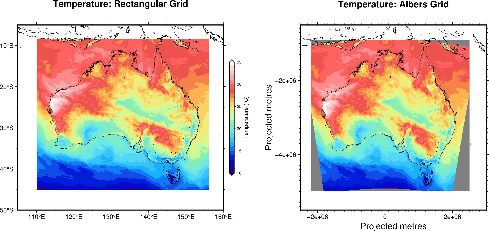

# Support for Albers Equal Area projection in MET/METPlus

The current (September 2025) version of MET and METPlus does not support the
Albers Equal Area projection (hereafter simply referred to as the Albers
projection). The Albers projection is a standard map projection for Australia,
and is used in the Bureau of Meteorology's IMPROVER software. There is a need
within the Bureau to have MET and METPlus support data on the Albers
projection.

This document is structured into following sections:

* Installation on a Bureau Linux computer
* Data format requirements for data on the Albers projection
* An example run of METPlus with data on the Albers projection

## Installation

To support Albers projection data in METPlus, the underlying MET code (which is
written in C++) needs to be modified and recompiled. No modifications for
METPlus are required.

### Preparing the environment for compiling MET/METPlus

Before compiling MET, create a conda environment with the various dependencies
needed by MET and METPlus. The following environment should suffice:

```
name: met
channels:
    - conda-forge
dependencies:
    - automake=1.16.5
    - python
    - netcdf4
    - netcdf-cxx4
    - gcc
    - gxx
    - gsl
    - proj
    - hdf4
    - hdf5
    - g2clib
    - nceplibs-bufr
    - hdfeos2
    - cairo
    - freetype
    - metplus
```

If the environment is saved in a file named `met.yml`, the following commands
will build and activate the environment. The `conda deactivate` is simply in
case another environment is currently loaded.

```
conda deactivate
conda env create -f met.yml
conda activate met
```

### Checkout the new MET code and compile it

In the previous section we installed an environment that has all the
dependencies for MET and METPlus. Indeed, we've already install METPlus,
because no changes to METPlus are required, only the underlying MET code.

The modified MET code exists in my GitHub repository. By the time you are
reading this document it may have been moved upstream to the DTCentre
repository. Assuming you're getting the code from my repository, here is how we
compiled the MET code on the machine called `borabora`.

First it is necessary to set some environment variables which point to where
the dependencies installed in the previous section live, amongst other things.
These are the settings for various environment variables which I have been
using:

```
export FFLAGS="-O2 -fPIE"
export BUFRLIB_NAME=-lbufr_4
export MET_BUFR=${HOME}/miniconda3/envs/met
export MET_PROJ=${HOME}/miniconda3/envs/met
export MET_NETCDF=${HOME}/miniconda3/envs/met
export MET_HDF5=${HOME}/miniconda3/envs/met
export MET_GSL=${HOME}/miniconda3/envs/met
export MET_GRIB2C=${HOME}/miniconda3/envs/met
```

Now we can compile and install the MET code.  The directory to use to checkout
and install the code in (`area_to_install_MET`) can be anything convenient for
the user:

```
cd area_to_install_MET
git clone git@github.com:thbom001/MET.git
cd MET
git checkout albers
make clean all install
```

Compilation of the MET code (the `make all` step) takes a few minutes.

### How to use

To test the new Albers projection functionality, we took an existing METPlus
configuration which processed files on a regular longitude-latitude grid, and
replaced the files with new ones on an Albers grid. Examples of the original
input files and the new Albers grid input files are shown below.



If the new projection functionality in the base MET code is working properly,
then METPlus verification statistics for the data on the two grids should be
similar (because the only difference between the two grids is the map
projection the data are on).

Sample files for nine days during April 2025 are in the sub-directories of
`/mnt/eta_storage/metplus/tph/processed` on `borabora`. The files on a
rectangular longitude-latitude grid have names beginning with `lonlat_`, and
files on an Albers grid have names beginning with `albers_`.

Reza provided me with METPlus configuration files to generate verification
statistics. I ran the scripts over the regular gridded data, and the Albers
gridded data. The results are compared below.
